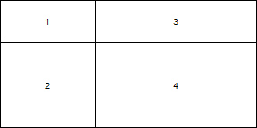
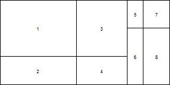
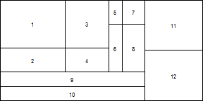
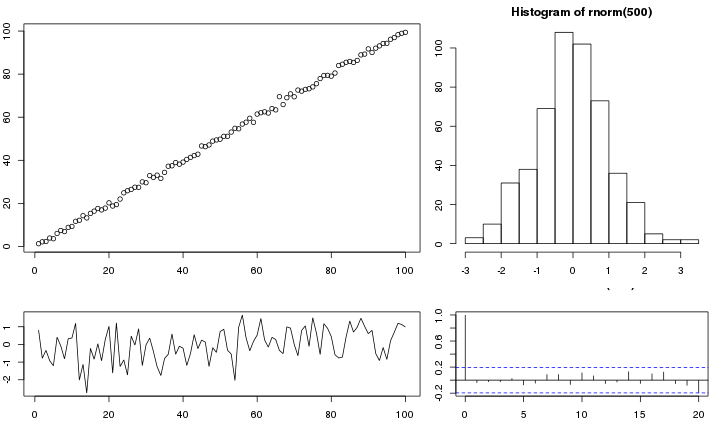
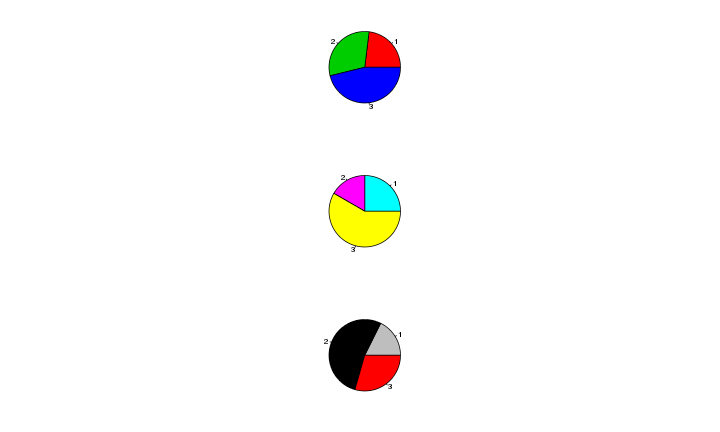
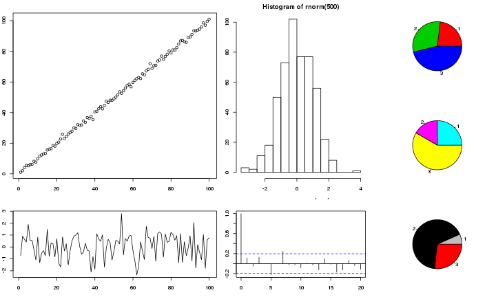
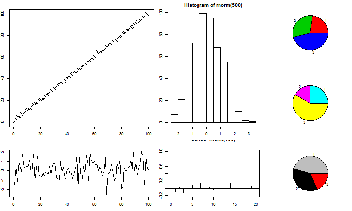

customLayout
========================================================


`customLayout` is a simple extension of basic `layout` function from `R`.

## Instalation:

`customLayout` is available only via GitHub and can be installed using `devtools`:


```r
require(devtools)
install_github("customLayout",username="zzawadz")
```


## Basic functionality:

You can simply create layouts like in base R:

```r
require(customLayout)
lay = layCreate(matrix(1:4,nc=2),widths=c(3,2),heights=c(2,1))
layShow(lay)
```

 

```r
lay2 = layCreate(matrix(1:4,nc=2),widths=c(3,5),heights=c(2,4))
layShow(lay2)
```

 
But main strength of this package is in combining created layouts with specific ratio:

```r
# lay will be 3 times wider that lay2
# all ascects in lay and lay2 will be preserved
cl = layColBind(lay,lay2, widths=c(3,1))
layShow(cl)
```

 
You can also create even more complicated layouts:

```r
lay3 = layCreate(matrix(1:2))
lay4 = layRowBind(cl,lay3, heights=c(5,2))
layShow(lay4)
```

 

```r
lay5 = layColBind(lay4,lay3, widths=c(5,2))
layShow(lay5)
```

 


## Split layout

You can create very complicated layouts by splitting one field:


```r
require(customLayout)
lay = layCreate(matrix(1:4,nc=2),widths=c(3,2),heights=c(2,1))
layShow(lay)
```

 

```r
lay2 = layCreate(matrix(1:4,nc=2),widths=c(3,5),heights=c(2,4))
layShow(lay2)
```

 

```r
# Split field 4 from lay into lay2:
slay = laySplitField(lay, lay2, field = 4)
layShow(slay)
```

 


## Example session:


```r
require(customLayout)
par(mar = c(3,2,2,1))
lay = layCreate(matrix(1:4,nc=2),widths=c(3,2),heights=c(2,1))
lay2 = layCreate(matrix(1:3))
cl = layColBind(lay,lay2, widths=c(3,1))
laySet(cl) # initialize drawing area
plot(1:100+rnorm(100))
plot(rnorm(100), type = "l")
hist(rnorm(500))
acf(rnorm(100))
pie(c(3,4,6),col = 2:4)
pie(c(3,2,7),col = 2:4+3)
pie(c(5,4,2),col = 2:4+6)
```

 


