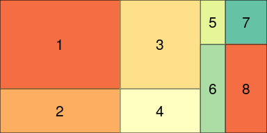
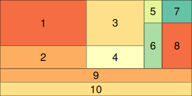
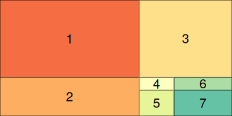
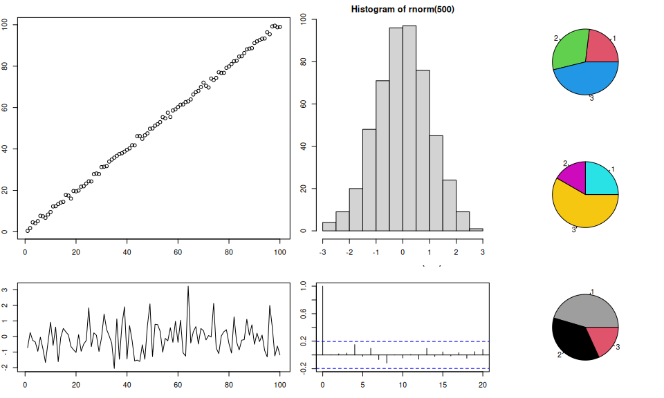
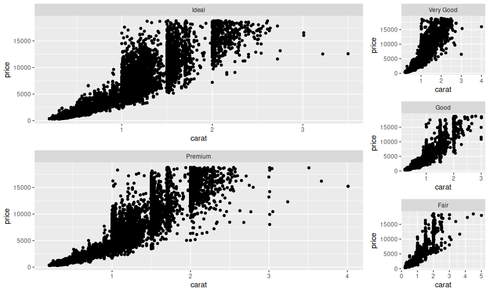

# customLayout

<!-- README.md is generated from README.Rmd. Please edit that file -->

[](https://github.com/zzawadz/customLayout/stargazers)
[](https://github.com/zzawadz/customLayout)

[](https://cran.r-project.org/package=customLayout)
[](https://cran.rstudio.com/package=customLayout)
[](https://cran.rstudio.com/web/packages/customLayout/index.html)
[](https://travis-ci.org/zzawadz/customLayout)
[](https://ci.appveyor.com/project/zzawadz/customLayout)
[](https://codecov.io/github/zzawadz/customLayout?branch=master)
[](https://www.repostatus.org/#active)

`customLayout` is a simple extension of the basic `layout` function from
`R` but it works not only with `base` and `grid` graphics systems, but
also with PowerPoint slides using `officer` package.

## Instalation:

`customLayout` is available on CRAN:

``` r
install.packages("customLayout")
```

The development version can be installed from GitHub using `devtools`:

``` r
require(devtools)
install_github("zzawadz/customLayout")
```

## Basic functionality:

You can create layouts in the using the same syntax as in the base
`layout` function:

``` r
library(customLayout)
lay <- lay_new(
  matrix(1:4, nc = 2),
  widths = c(3, 2),
  heights = c(2, 1))
lay_show(lay)
```

<!-- -->

``` r

lay2 <- lay_new(
  matrix(1:4, nc = 2),
  widths = c(3, 5),
  heights = c(2, 4))
lay_show(lay2)
```

<!-- -->

But the main strength of this package is in combining created layouts
with specific ratio:

``` r
# lay will be 3 times wider that lay2
# all ascects in lay and lay2 will be preserved
cl = lay_bind_col(lay, lay2, widths = c(3, 1))
lay_show(cl)
```

<!-- -->

You can create even more complicated layouts:

``` r
lay3 <- lay_new(matrix(1:2))
lay4 <- lay_bind_row(cl, lay3, heights = c(5, 2))
lay_show(lay4)
```

<!-- -->

``` r

lay5 <- lay_bind_col(lay4, lay3, widths = c(5, 2))
lay_show(lay5)
```

<!-- -->

## Split layout

You can create very complicated layouts by splitting one field:

``` r
library(customLayout)
lay <- lay_new(
  matrix(1:4, nc = 2),
  widths = c(3, 2),
  heights = c(2, 1))
lay_show(lay)
```

<!-- -->

``` r
lay2 <- lay_new(
  matrix(1:4, nc = 2),
  widths = c(3, 5),
  heights = c(2, 4))
lay_show(lay2)
```

<!-- -->

``` r

# Split field 4 from lay into lay2:
slay <- lay_split_field(lay, lay2, field = 4)
lay_show(slay)
```

<!-- -->

## Example session:

### Base graphics

``` r
library(customLayout)
par(mar = c(3, 2, 2, 1))
lay  <- lay_new(
  matrix(1:4, nc = 2),
  widths = c(3, 2),
  heights = c(2, 1))
lay2 <- lay_new(matrix(1:3))
cl   <- lay_bind_col(lay, lay2, widths = c(3, 1))

lay_set(cl) # initialize drawing area

set.seed(123)
plot(1:100 + rnorm(100))
plot(rnorm(100), type = "l")
hist(rnorm(500))
acf(rnorm(100))
pie(c(3, 4, 6), col = 2:4)
pie(c(3, 2, 7), col = 2:4 + 3)
pie(c(5, 4, 2), col = 2:4 + 6)
```

<!-- -->

## Grid graphics (ggplot2 and friends)

``` r
library(customLayout)
library(ggplot2)
library(gridExtra)

lay  <- lay_new(
  matrix(1:2, ncol = 1))
lay2 <- lay_new(matrix(1:3))
cl   <- lay_bind_col(lay, lay2, widths = c(3, 1))


library(ggplot2)
cuts <- sort(unique(diamonds[["cut"]]),
            decreasing = TRUE)

make_cut_plot <- function(cut) {
  dd <- diamonds[diamonds[["cut"]] == cut, ]
  pl <- ggplot(dd) +
      geom_point(aes(carat, price)) +
      facet_wrap("cut")
  pl
}

plots <- lapply(cuts, make_cut_plot)

lay_grid(plots, cl)
```

<!-- -->

## PowerPoint support

Layouts created using `customLayout` package can be used to arrange
elements on the PowerPoint slide. For the detailed description please
refer to [the
vignette](https://www.customlayout.zstat.pl/articles/layouts-for-officer-power-point-document.html):

``` r
vignette("layouts-for-officer-power-point-document", package = "customLayout")
```

<!-- -->
