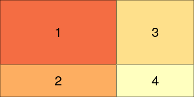
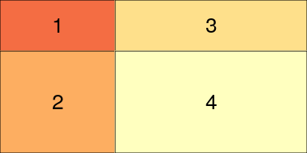
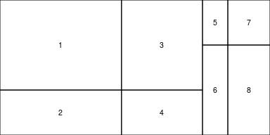
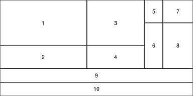
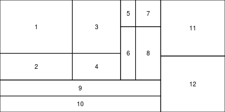
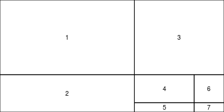
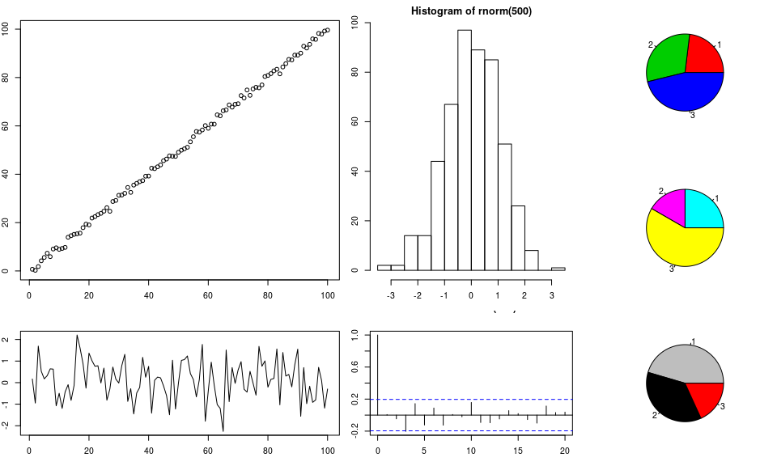

customLayout
============

`customLayout` is a simple extension of basic `layout` function from
`R`.

Instalation:
------------

`customLayout` is available only via GitHub and can be installed using
`devtools`:

    require(devtools)
    install_github("customLayout",username="zzawadz")

Basic functionality:
--------------------

You can simply create layouts like in base R:

    library(customLayout)
    lay <- layCreate(
      matrix(1:4, nc = 2),
      widths = c(3, 2),
      heights = c(2, 1))
    layShow(lay)

    lay2 <- layCreate(
      matrix(1:4, nc = 2),
      widths = c(3, 5),
      heights = c(2, 4))
    layShow(lay2)

But main strength of this package is in combining created layouts with
specific ratio:

    # lay will be 3 times wider that lay2
    # all ascects in lay and lay2 will be preserved
    cl = layColBind(lay, lay2, widths = c(3, 1))
    layShow(cl)

You can also create even more complicated layouts:

    lay3 <- layCreate(matrix(1:2))
    lay4 <- layRowBind(cl, lay3, heights = c(5, 2))
    layShow(lay4)

    lay5 <- layColBind(lay4, lay3, widths = c(5, 2))
    layShow(lay5)

Split layout
------------

You can create very complicated layouts by splitting one field:

    library(customLayout)
    lay <- layCreate(
      matrix(1:4, nc = 2),
      widths = c(3, 2),
      heights = c(2, 1))
    layShow(lay)

    lay2 <- layCreate(
      matrix(1:4, nc = 2),
      widths = c(3, 5),
      heights = c(2, 4))
    layShow(lay2)

    # Split field 4 from lay into lay2:
    slay <- laySplitField(lay, lay2, field = 4)
    layShow(slay)

Example session:
----------------

### Base graphics

    library(customLayout)
    par(mar = c(3, 2, 2, 1))
    lay  <- layCreate(
      matrix(1:4, nc = 2),
      widths = c(3, 2),
      heights = c(2, 1))
    lay2 <- layCreate(matrix(1:3))
    cl   <- layColBind(lay, lay2, widths = c(3, 1))

    laySet(cl) # initialize drawing area

    set.seed(123)
    plot(1:100 + rnorm(100))
    plot(rnorm(100), type = "l")
    hist(rnorm(500))
    acf(rnorm(100))
    pie(c(3, 4, 6), col = 2:4)
    pie(c(3, 2, 7), col = 2:4 + 3)
    pie(c(5, 4, 2), col = 2:4 + 6)

Grid graphics (ggplot2 and friends)
-----------------------------------

    library(customLayout)
    library(ggplot2)
    library(gridExtra)

    lay  <- layCreate(
      matrix(1:2, ncol = 1))
    lay2 <- layCreate(matrix(1:3))
    cl   <- layColBind(lay, lay2, widths = c(3, 1))

    library(ggplot2)
    cuts <- sort(unique(diamonds[["cut"]]),
                decreasing = TRUE)

    make_cut_plot <- function(cut) {
      dd <- diamonds[diamonds[["cut"]] == cut, ]
      pl <- ggplot(dd) +
          geom_point(aes(carat, price)) +
          facet_wrap("cut")
      ggplotGrob(pl)
    }

    grobs <- lapply(cuts, make_cut_plot)

    layGrid(grobs, cl)

