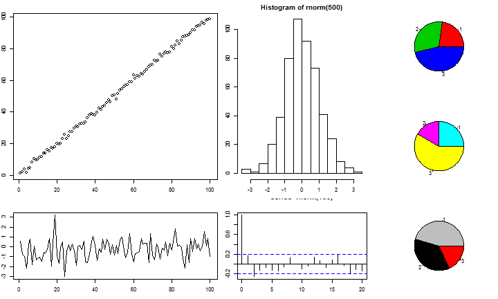
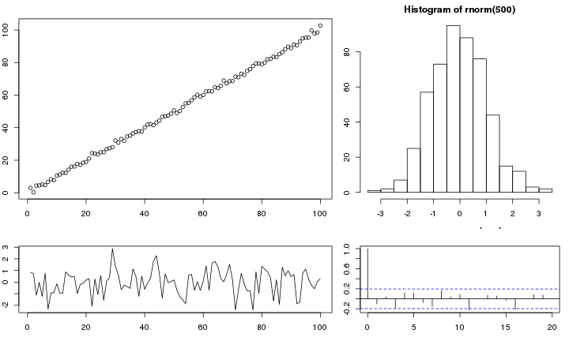
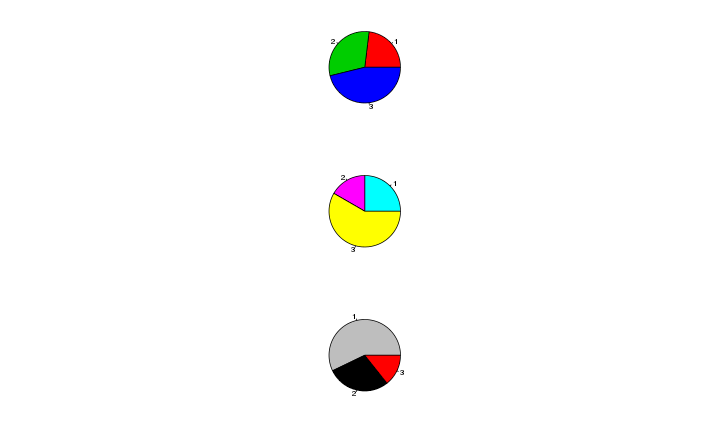
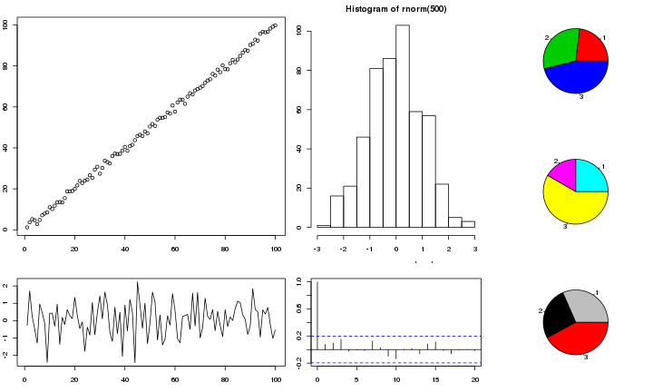

customLayout
========================================================


`customLayout` is a simple extension of basic `layout` function from `R`.

## Instalation:

`customLayout` is available only via GitHub and can be installed using `devtools`:


```r
require(devtools)
install_github("customLayout", username = "zzawadz")
```


## Basic functionality:

You can simply create layouts like in base R:

```r
require(customLayout)
lay = createLayout(matrix(1:4, nc = 2), widths = c(3, 2), heights = c(2, 1))
layoutShow(lay)
```

 

```r
lay2 = createLayout(matrix(1:4, nc = 2), widths = c(3, 5), heights = c(2, 4))
layoutShow(lay2)
```

 

But main strength of this package is in combining created layouts with specific ratio:

```r
# lay will be 3 times wider that lay2
# all ascects in lay and lay2 will be preserved
cl = colBind(lay,lay2, widths=c(3,1))
layoutShow(cl)
```

 

You can also create even more complicated layouts:

```r
lay3 = createLayout(matrix(1:2))
lay4 = rowBind(cl, lay3, heights = c(5, 2))
layoutShow(lay4)
```

 

```r

lay5 = colBind(lay4, lay3, widths = c(5, 2))
layoutShow(lay5)
```

 


## Example session:


```r
require(customLayout)
par(mar = c(3, 2, 2, 1))
lay = createLayout(matrix(1:4, nc = 2), widths = c(3, 2), heights = c(2, 1))
lay2 = createLayout(matrix(1:3))
cl = colBind(lay, lay2, widths = c(3, 1))
setLayout(cl)  # initialize drawing area
plot(1:100 + rnorm(100))
plot(rnorm(100), type = "l")
hist(rnorm(500))
acf(rnorm(100))
pie(c(3, 4, 6), col = 2:4)
pie(c(3, 2, 7), col = 2:4 + 3)
pie(c(5, 4, 2), col = 2:4 + 6)
```

 


## Store plots in Layout

You can create `Layout` with plots and then combine it with another `Layout`.


```r
require(customLayout)
par(mar = c(3,2,2,1))


# listPlots capture code for drawing plots
plots = listPlot(plot(1:100+rnorm(100)),
plot(rnorm(100), type = "l"),
hist(rnorm(500)),
acf(rnorm(100)))
lay = createLayout(matrix(1:4,nc=2),widths=c(3,2),heights=c(2,1),plots=plots)


# renderPlots create drawing area and execute code stored in Layout
renderPlots(lay)
```

 

```r

pie_plots = listPlot(pie(c(3,4,6),col = 2:4),
    pie(c(3,2,7),col = 2:4+3),
    {
      # you can capture code in {}
      x = sample(sample(1:10,3))
      pie(x,col = 2:4+6)
      }
)

lay2 = createLayout(matrix(1:3),plots=pie_plots)
renderPlots(lay2)
```

 

```r

cl = colBind(lay,lay2, widths=c(3,1))
# render combined layout
renderPlots(cl)
```

 


