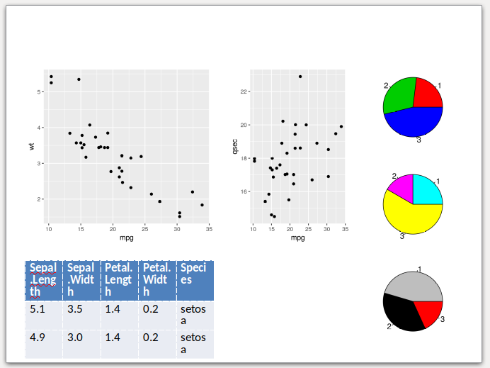
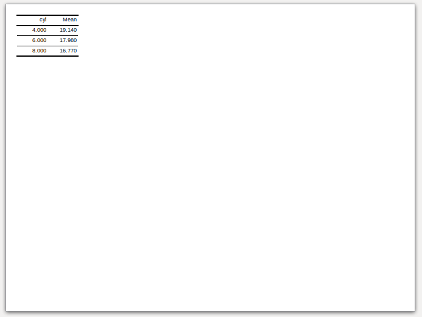
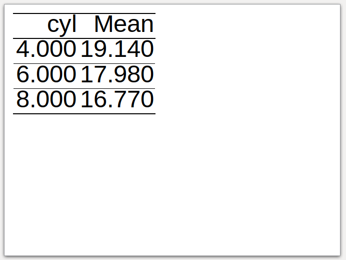
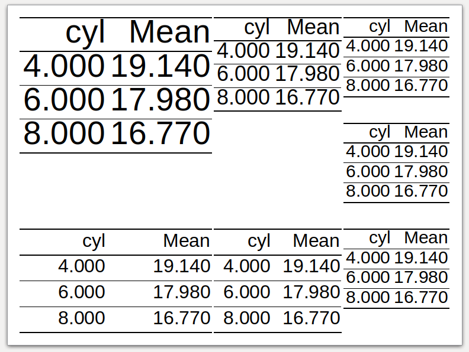

```{r setup, include = FALSE}
knitr::opts_chunk$set(
  collapse = TRUE,
  comment = "#>"
)
```

## Introduction

This document shows how to work with PowerPoint files in R using customLayout approach.

Let's start by creating a layout. `lay` and `lay2` will be used to store the content of the slide (plots, tables, text), and `titleLay` will serve as a container for the title of the slide. 

It seems that merging the title placeholder in the last step allows to the easy control its ratio to the content of the slide. Note that `titleLay` is merged with `lay3` (combination of `lay` and `lay2`) using a ratio 1:7, so the content of the slide will occupy about 87,5% of the area (`7/(1+7)`). 

```{r}
library(customLayout)
library(officer)
library(magrittr)
library(ggplot2)

lay  <- lay_new(matrix(1:4,nc=2),widths=c(3,2),heights=c(2,1))
lay2 <- lay_new(matrix(1:3))
titleLay <- lay_new(1, widths = 1, heights = 1)

lay3   <- lay_bind_col(lay,lay2, widths=c(3,1))
layout <- lay_bind_row(titleLay, lay3, heights = c(1,7))

lay_show(layout)
```

In the next step, one needs to create an officer layout from an existing `layout` object. It is done by calling `phl_layout`, which allows specifying the target size of the slide and margins.

```{r}
## create officer layout
offLayout <- phl_layout(layout,
    margins = c(0.25, 0.25, 0.25, 0.25),
    innerMargins = rep(0.15,4))
```

## `ggplot2`

Then, the elements of the slide are added using functions with `phl_*` prefix. The code below adds two ggplot plots into the slide using `phl_with_gg`.

```{r}
pptx <- read_pptx() %>%
  add_slide(master = "Office Theme", layout = "Title and Content")

### fill first placeholder

plot1 <- qplot(mpg, wt, data = mtcars)
plot3 <- qplot(mpg, qsec, data = mtcars)
pptx <- phl_with_gg(pptx, offLayout, 2, plot1)
pptx <- phl_with_gg(pptx, offLayout, 4, plot3)
```


## Base graphics

It is also worth to note that pptx files allow intermixing base graphics with grid graphics (ggplot2 and friends). The example below adds a few pie charts (note from the author - I'm not a fan of pie charts. Please don't use them on real slides). In this case `phl_with_plot` requires a function which creates a plot.

```{r}
pl5 <- function() {
  par(mar = rep(0.1, 4))
  pie(c(3, 4, 6), col = 2:4)
}
pl6 <- function() {
  par(mar = rep(0.1, 4))
  pie(c(3, 2, 7), col = 2:4 + 3)
}
pl7 <- function() {
  par(mar = rep(0.1, 4))
  pie(c(5, 4, 2), col = 2:4 + 6)
}

pptx <- phl_with_plot(pptx, offLayout, 6, pl5)
pptx <- phl_with_plot(pptx, offLayout, 7, pl6)
pptx <- phl_with_plot(pptx, offLayout, 8, pl7)
```


## Basic tables

To export data.frame to the slide, one needs to use `phl_with_table`. 

```{r}
pptx <- phl_with_table(pptx, offLayout, 3, head(iris, 2))
```

Note, that in the current version `customLayout` is not able to fit the table perfectly to your slide. The desired width will be matched at the expense of the table height and text-wrapping. See the output slide created from the code above. As you can see, the table is a bit too tall, and the texts in cells are inelegantly wrapped.



## Text

Inserting the text works in a very similar fashion to the officer package, just use the `phl_with_text` function. To add the formatting to the text use the `style` argument as in the example below (`phl_with_text` internally uses `officer::ph_add_text`).

```{r}
pptx <- phl_with_text(pptx, offLayout, 1, "Custom Layout")

style <- fp_text(font.size = 24, color = "red")
pptx  <- phl_with_text(pptx, offLayout, 5, 
          "Lorem ipsum", type = "body", style = style)
```


## Render document

To render document use the standard `print` function from `officer`.

```{r, eval=FALSE}
file <- tempfile(fileext = ".pptx")
print(pptx, file)
```

## `flextable`s

### Getting started

To get more control over created tables, one can use the `flextable` package (https://davidgohel.github.io/flextable/index.html), which is also supported by the `customLayout` by the `phl_with_flextable` function.

Let's start with preparing the layout and sample data.frame for further examples:

```{r}
library(customLayout)
library(flextable)
library(dplyr)
library(officer)

lay  <- lay_new(matrix(1:4,nc=2),widths=c(3,2),heights=c(2,1))
lay2 <- lay_new(matrix(1:3))
layout   <- lay_bind_col(lay,lay2, widths=c(3,1))
lay_show(layout)


offLayout <- phl_layout(layout,
    margins = c(0.25, 0.25, 0.25, 0.25),
    innerMargins = rep(0.15,4))

pptx <- read_pptx() %>%
  add_slide(master = "Office Theme", layout = "Title and Content")

table <- mtcars %>% 
  group_by(cyl) %>% 
  summarise(Mean =round(mean(qsec), 2))
```

### Simple `flextable`

To add the `flextable` to the slide, one needs to convert the data. frame to the `flextable` object. Then the function `phl_with_flextable` can be used:

```{r}
pptx <- read_pptx() %>%
  add_slide(
    master = "Office Theme",
    layout = "Title and Content")

flTableRaw <- flextable(table)
pptx <- phl_with_flextable(pptx, 
      olay = offLayout, 1, flTableRaw)
```



### Fit the table to the placeholder

However, the `phl_with_flextable` does not modify any parameters of the table and writes it to the pptx as is. It means that the user needs to specify the correct font size, the widths, and heights for columns and rows. It might be quite hard to do, but the `customLayout` provides the `phl_adjust_table` function which takes a data.frame as an argument and tries to find as large font size, widths and heights as possible for given placeholder in the layout. Note that this function uses some simple heuristics, and might not always work as expected, and some manual tuning will be required.

```{r}
pptx <- read_pptx() %>%
  add_slide(
    master = "Office Theme",
    layout = "Title and Content")

flTable <- phl_adjust_table(table, olay = offLayout, id = 1)
pptx <- phl_with_flextable(pptx, 
      olay = offLayout, 1, flTable)
```



### Formatted `flextable`

After calling the  `phl_adjust_table` one can modify the table in any way. Go to the https://davidgohel.github.io/flextable/articles/overview.html for more examples.

```{r}
pptx <- read_pptx() %>%
  add_slide(
    master = "Office Theme",
    layout = "Title and Content")

flTable <- phl_adjust_table(table, olay = offLayout, id = 1)

flTable <-  bg(flTable, bg = "#E4C994", part = "header")
flTable <-  bg(flTable, bg = "#333333", part = "body")
flTable <- color(flTable, color = "#E4C994")

pptx <- phl_with_flextable(pptx, 
      olay = offLayout, 1, flTable)
```


### Fit the table to the placeholder - part II

The example below shows the appearance of the table in each placeholder of the layout. It seems that it works reasonably well.

```{r, results='hide'}
pptx <- read_pptx() %>%
  add_slide(
    master = "Office Theme",
    layout = "Title and Content")

lapply(seq_len(length(offLayout)), function(i) {
  tbl <- phl_adjust_table(table, offLayout, i)  
  phl_with_flextable(pptx, olay = offLayout, i, tbl)
  invisible()
})
```

